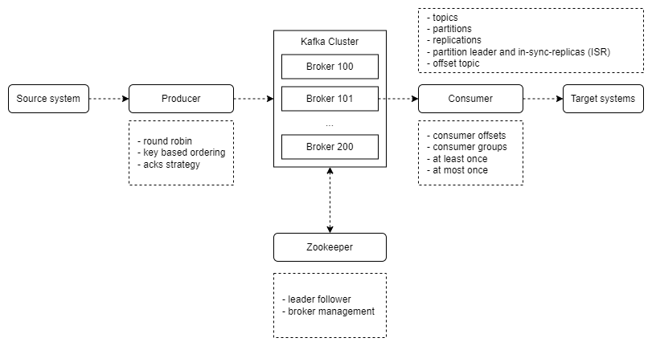

# Apache Kafka overview and commands <!-- omit in toc -->

## Contents <!-- omit in toc -->

- [1. Types of problems organisations are facing with manually integration](#1-types-of-problems-organisations-are-facing-with-manually-integration)
- [2. Why Apache Kafka?](#2-why-apache-kafka)
- [3. Apache Kafka: Use cases](#3-apache-kafka-use-cases)
  - [3.1. Real cases](#31-real-cases)
- [4. Overview](#4-overview)
- [5. Basic concepts](#5-basic-concepts)
  - [5.1. Topics, partitions and offsets](#51-topics-partitions-and-offsets)
    - [5.1.1. Topics](#511-topics)
    - [5.1.2. Partitions and offsets](#512-partitions-and-offsets)
    - [5.1.3. Topic example: truck_gps](#513-topic-example-truck_gps)
    - [5.1.4. Important notes](#514-important-notes)
  - [5.2. Producers and message keys](#52-producers-and-message-keys)
    - [5.2.1. Producers](#521-producers)
    - [5.2.2. Producers: Message keys](#522-producers-message-keys)
    - [5.2.3. Kafka messages anatomy](#523-kafka-messages-anatomy)
    - [5.2.4. Kafka message serializer](#524-kafka-message-serializer)
    - [5.2.5. Kafka message key hashing](#525-kafka-message-key-hashing)
  - [5.3. Consumers and deserialization](#53-consumers-and-deserialization)
    - [5.3.1. Consumers](#531-consumers)
    - [5.3.2. Consumer deserializer](#532-consumer-deserializer)
  - [5.4. Consumer groups and consumer offsets](#54-consumer-groups-and-consumer-offsets)
    - [5.4.1. Consumer groups](#541-consumer-groups)
    - [5.4.2. What if too many consumers?](#542-what-if-too-many-consumers)
    - [5.4.3. Multiple consumers on one topic](#543-multiple-consumers-on-one-topic)
    - [5.4.4. Consumer offsets](#544-consumer-offsets)
    - [5.4.5. Delivery semants for consumers](#545-delivery-semants-for-consumers)
  - [5.5. Brokers and Topics](#55-brokers-and-topics)
    - [5.5.1. Kafka brokers](#551-kafka-brokers)
    - [5.5.2. Kafka broker discovery](#552-kafka-broker-discovery)
  - [5.6. Topic replication](#56-topic-replication)
    - [5.6.1. Replication factor](#561-replication-factor)
    - [5.6.2. Concept of Leader for a Partition](#562-concept-of-leader-for-a-partition)
    - [5.6.3. Default producer and consumer behavior with leaders](#563-default-producer-and-consumer-behavior-with-leaders)
  - [5.7. Producer Acknowledgements and Topic Durability](#57-producer-acknowledgements-and-topic-durability)
    - [5.7.1. Kafka topic durability](#571-kafka-topic-durability)
  - [5.8. Zookeeper](#58-zookeeper)
    - [5.8.1. Should you use Zookeeper?](#581-should-you-use-zookeeper)
  - [5.9. Fafka KRaft](#59-fafka-kraft)
  - [5.10. Resume](#510-resume)
- [6. Partitions](#6-partitions)
  - [6.1. Partitions count and replication factor](#61-partitions-count-and-replication-factor)
    - [6.1.1. Choosing the partitions count](#611-choosing-the-partitions-count)
    - [6.1.2. Choosing the replication factor](#612-choosing-the-replication-factor)
  - [6.2. Cluster guidelines](#62-cluster-guidelines)
  - [6.3. Topic naming conventions](#63-topic-naming-conventions)
- [7. Commands](#7-commands)
  - [7.1. Topics commands](#71-topics-commands)
  - [7.2. Producer commands](#72-producer-commands)
  - [7.3. Consumer commands](#73-consumer-commands)
  - [7.4. Consumer groups](#74-consumer-groups)
- [8. Ui Application](#8-ui-application)

## 1. Types of problems organisations are facing with manually integration

- If you have 4 source systems, and 6 target systems, you need to write 24 integrations!
- Each integration comes with difficulties around:
  - Protocol - how the data ins transported (TCP, HTTP, REST, FTP, JDBC...).
  - Data format - how the data is parsed (Binary, CSV, JSON, Avro, Protobuf...).
  - Data schema and evolution - how the data is shaped and may change.
- Each source system will have an increased load from the connections.

## 2. Why Apache Kafka?

- Created by LinkedIn, now Open-Source project mainly maintained by Confluent, IBM, Cloudera.
- Distributed, resilient architecture, fault tolerant.
- Horizontal scalability:
  - Can scale to 100s of brokers.
  - Can scale to millions of messages per second.
- High performance (latency of less than 10ms) - real-time.

## 3. Apache Kafka: Use cases

- Messaging system.
- Activity tracking.
- Gather metrics from many different locations.
- Application logs gathering.
- Stream processing (with the Kafka Streams API for example).
- De-coupling of system dependencies.
- Integration with Spark, Flink, Storm, Hadoop, and many other Big Data technologies.
- Micro-services pub/sub.

### 3.1. Real cases

- Netflix uses Kafka to recommendations in real-time while you are watching TV shows.
- Uber uses Kafka to gather user, taxi and trip data in real-time to compute and forecast demand, and compute surge pricing in real-time.
- LinkedIn uses Kafka to prevent spam, collect user interactions to make better connection recommendations in real-time.

## 4. Overview

- Kafka's idea is to centralize this exchange of messages between other systems to converse in a single and exclusively with Kafka to send and receive messages, then explaining better what would be the Apache Kafka:
  - It is a data streaming platform.
  - He simply receives bytes and delivers bytes.
  - It allows you to publish and subscribe to the ends of records as if they were a queue.
  - It stores these streams in a durable and fault-tolerant way.
  - So you published the message someone can consume this message but not necessarily deleted in this moment is all configured.
  - You can define how many days this message is stored and you can currently read these messages.
  - In case of an error you can create a new application that reads the same data and start reading right away.

## 5. Basic concepts

### 5.1. Topics, partitions and offsets

#### 5.1.1. Topics

- Topics: a particular stream of data.
- Example: Logs, purchases, twitter_tweets, trucks_gps.
- Like a table in a database (without all the constraint).
- You can have as many topics as you want.
- A topic is identified by its name.
- Any kind of message format.
- The sequence of messages is called a data stream.
- You cannot query topics, instead, use Kafka Producers to send data and Kafka Consumers to read the data.
- **You only need to connect to one broker (any broker) and just provide the topic name you want to read from. Kafka will route your calls to the appropriate brokers and partitions for you!**

#### 5.1.2. Partitions and offsets

- Topics are split in partitions (Example: 100 partitions):
  - Messages within each partition are ordered.
  - Each message within a partitions gets an incremental id, called offset.
- Kafka topics are immutable: once data is written to a partition, it cannot be changed.
- Kafka Consumer Offsets are stored in Kafka.

#### 5.1.3. Topic example: truck_gps

- Say you have a fleet of trucks; each truck report its GPS position to Kafka.
- Each truck will send a message to Kafka every 20 seconds, each message will contain the truck ID and the truck position (latitude and longitude).
- You can have a topic trucks_gps that contain the position of all trucks.
- We choose to create that topic with 10 partitions (arbitrary number).

#### 5.1.4. Important notes

- Once the data is written to a partition, **it cannot be change** (immutability).
- Data is kept only for a limited time (default is one week - configurable).
- Offset only have a meaning for a specific partition.
  - E.g. offset 3 in partition 0 doesn't represent the same data as offset 3 in partition 1.
  - Offsets are not re-used even if previous messages have been deleted.
- Order is guaranteed only within a partition (not across partitions).
- Data is assigned randomly to a partition unless a key is provided (more on this later).
- You can have as many partition per topic as you want.

### 5.2. Producers and message keys

#### 5.2.1. Producers

- Producers write data to topics (which are made of partitions).
- Producers know to which partition to write to (and which Kafka broker has it).
- In case of Kafka broker failures, Producers will automatically recover.

#### 5.2.2. Producers: Message keys

- Producers can choose to send a **key** with the message (string, number binary, etc...).
- If `key = null`, data is sent round robin (partition 0, then 1, then 2...).
- If `key != null`, then all messages for that key will always go to the same partition (hashing).
- A key are typically sent if you need message ordering for a specific field (e.g. food_truck_id).

#### 5.2.3. Kafka messages anatomy

- Key - binary : Value - binary.
- Compression type : none, gzip, sanppy, lz4, zstd.
- Headers (optional).
- Partition + Offset.
- Timestamp (system of user set).

#### 5.2.4. Kafka message serializer

- Kafka only accepts bytes as an input from producers and send bytes out as an output to consumers.
- Message serialization means transforming objects / data into bytes.
- They are used on the value and the key.
- Common serializers:
  - String (incl. JSON).
  - Int, float.
  - Avro.
  - Protobuf.

#### 5.2.5. Kafka message key hashing

- A Kafka partitioner is a code logic that takes a record and determines to which partition to send it intro.
- **Key Hashing** is the process of determining the mapping of a key to a partition
- In the default Kafka partitioner, the keys are hashed using the murmur2 algorithm, with the formula below:
  - `targetPartition = Math.abs(Utils.murmur2(keyBytes)) % (numPartition - 1)`

### 5.3. Consumers and deserialization

#### 5.3.1. Consumers

- Consumers read data from a topic (identified by name) - pull model.
- Consumers automatically know which broker to read from.
- In case of broker failures, consumers know how to recover.
- Data is read in order from low to high offset **within each partitions**.

#### 5.3.2. Consumer deserializer

- Deserializer indicates how to transform bytes into objects / data.
- They are used on the value and the key of the message.
- Common deserializers:
  - String (incl. JSON).
  - Int, Float.
  - Avro.
  - Protobuf.
- The serialization / deserialization type must not change during a topic lifecycle (create a new topic instead).

### 5.4. Consumer groups and consumer offsets

#### 5.4.1. Consumer groups

- All the consumers in an application read data as a consumer groups.
- Each consumer within a group reads from exclusive partitions.

#### 5.4.2. What if too many consumers?

- If have more consumers than partitions, some consumers will be inactive.

#### 5.4.3. Multiple consumers on one topic

- In Apache Kafka it is acceptable to have multiple consumer groups on the same topic.
- To create distinct consumer groups, use the consumer property group.id.

#### 5.4.4. Consumer offsets

- Kafka stores the offsets at which a consumer group has been reading.
- The offsets committed are in Kafka topic named `__consumer_offsets`
- When a consumer in a group has processed data received from Kafka, it should be **periodically** committing the offsets (the Kafka broker will write to `__consumer_offsets`, not the group itself).
- If a consumer dies, it will be able to read back from where it left off thanks to the committed consumer offsets!

#### 5.4.5. Delivery semants for consumers

- There are 3 delivery semantics if you choose to commit manually:
  - At least once (usually preferred):
    - Offsets are committed after the message is processed.
    - if the processing goes wrong, the message will be read again.
    - This can result in duplicate processing of messages. Make sure your processing is idempotent(i.e. processing again the messages won't impact your systems).
  - At most once:
    - Offsets are committed as soon as messages are received.
    - If the processing goes wrong, some messages will be lost (they won't be read again).
  - Exactly once:
    - For Kafka => Kafka workflow: Use the Transaction API (easy with Kafka Streams API).
    - For Kafka => External System workflows: Use an idempotent consumer.

### 5.5. Brokers and Topics

#### 5.5.1. Kafka brokers

- A Kafka cluster is composed of multiple brokers (servers).
- Each broker is identified with its ID (integer).
- Each broker contains certain topic partitions.
- After connecting to any broker (called a bootstrap broker), you will be connected to the entire cluster (Kafka clients have smart mechanics for that).
- A good number to get started is 3 brokers, but some big clusters have over 100 brokers.
- **You only need to connect to one broker (any broker) and just provide the topic name you want to write to. Kafka Clients will route your data to the appropriate brokers and partitions for you!**

#### 5.5.2. Kafka broker discovery

- Every Kafka broker is also called a "bootstrap server".
- That means that **you only need to connect to one broker**, and the Kafka clients will know how to be connected to the entire cluster (smart clients).
- Each broker knows about all brokers, topics and partitions (metadata).

### 5.6. Topic replication

#### 5.6.1. Replication factor

- Topics should have a replication factor > 1 (usually between 2 and 3).
- This way if a broker is down, another broker can serve the data.
- Example: Topic-A with 2 partitions and replication factor of 2.

#### 5.6.2. Concept of Leader for a Partition

- At any time only ONE broker can be a leader for a given partition.
- Producers can only send data to the broker that is leader of a partition.
- The other brokers will replicate the data.
- Therefore, each partition has one leader and multiple ISR (in-sync replica).

#### 5.6.3. Default producer and consumer behavior with leaders

- Kafka Producers can only write to the leader broker for a partition.
- Kafka Consumers by default will read from the leader broker for a partition.
- Since Kafka 2.4 it is possible to configure consumers to read from the closest replica.
- This may help improve latency, and also decrease network costs if using the cloud.

### 5.7. Producer Acknowledgements and Topic Durability

- Producers can choose to receive acknowledgment of data writes:
  - acks=0: Producer won't wait for acknowledgment (possible data loss).
  - acks=1: Producer will wait for leader acknowledgment (limited data loss).
  - acks=all: Leader + replicas acknowledgment (no data loss).

#### 5.7.1. Kafka topic durability

- For a topic replication factor of 3, topic data durability can withstand 2 brokers loss.
- As a rule, for a replication factor of N, you can permanently lose up to N-1 brokers and still recover your data.

### 5.8. Zookeeper

- Manages brokers (keeps a list of then).
- Helps in performing leader election for partitions.
- Send notification to Kafka in case of changes (e.g. new topic, broker dies, broker comes up, delete topics, etc...).
- Kafka 2.x can't work without Zookeeper.
- Kafka 3.x can work without Zookeeper (KIP-500) - using Kafka Raft instead.
- Kafka 4.x will not have Zookeeper.
- Zookeeper by design operates with and odd numbers of servers (1,3,5,6).
- Has a leader (writes) the rest of the servers are followers (reads).
- (Zookeeper does NOT store consumer offsets with Kafka > v0.10).

#### 5.8.1. Should you use Zookeeper?

- With Kafka Brokers?
  - Yes, until Kafka 4.0 is out while waiting for Kafka without Zookeeper to be production-ready.
- With Kafka Clients?
  - Over time, the Kafka clients and CLI have been migrated to leverage the brokers as a connection endpoint instead of Zookeeper
  - Since Kafka 0.10, consumers store offset in Kafka and Zookeeper and must not connect to Zookeeper as it is deprecated
  - Since Kafka 2.2, the `kafka-topics.sh` CLI command references Kafka brokers and not Zookeeper for topic management (create, deletion, etc...) and the Zookeeper CLI argument is deprecated.
  - All the APIs and commands that were previously leveraging Zookeeper are migrated to use Kafka instead, so that when clusters are migrated to be without Zookeeper, the change is invisible to clients.
  - Zookeeper is also less secure than Kafka, and therefore Zookepper posts should only be opened to allow traffic from Kafka brokers, and not Kafka clients.
  - Therefore, to be a great modern-day Kafka developer, never ever use Zookeeper as a configuration in your Kafka clients, and other programs that connect to Kafka.

### 5.9. Fafka KRaft

- In 2020, the Apache Kafka project stated to work to remove the Zookeeper dependency from it (KIP-500).
- Zookeeper shows scaling issues then Kafka clusters have > 100,000 partitions.
- By removing Zookeeper, Apache Kafka can:
  - Scale to millions of partitions, and becomes easier to maintain and set-up.
  - Improve stability, makes it easier to monitor, support and administer.
  - Single security model for the whole system.
  - Single process to start with Kafka.
  - Faster controller shutdown and recovery time.
- Kafka 3.X now implements the Raft protocol (KRaft) in order to replace Zookeeper.

### 5.10. Resume

## 6. Partitions

### 6.1. Partitions count and replication factor

- The **two most important** parameters when creating a topic.
- They impact performance and durability of the system overall.
- It is best to get the parameters right the first time!
  - If the partitions count increases during a topic lifecycle, you will break your keys ordering guarantees.
  - If the replication factor increases during a topic lifecycle, you put more pressure on your cluster, which can lead to unexpected performance decrease.

#### 6.1.1. Choosing the partitions count

- Each partition can handle a throughput of a few MB/s (measure it for your project).
- More partitions implies:
  - Better parallelism, better throughput.
  - Ability to run more consumers in a group to scale (max as many consumers per group as partitions).
  - Ability to leverage more brokers if you have a large cluster.
  - BUT more election to perform for Zookeeper (if using Zookeeper).
  - BUT more files opened on Kafka.
- Guidelines:
  - **Partitions per topic = great question!**
    - (Intuition) Small cluster (< 6 brokers): 3x #brokers.
    - (Intuition) Big cluster (> 12 brokers): 2x #of Brokers.
    - Adjust for number of consumers you need to run in parallel at peak throughput.
    - Adjust for producer throughput (increase if super-high throughput or projected increase in the next 2 years).
    - **Every Kafka cluster will have different performance.**
    - Don't systematically create topics with 1000 partitions!

#### 6.1.2. Choosing the replication factor

- Should be at least 2, usually 3, maximum 4.
- The higher the replication factor (N):
  - Better durability of your system (N-1 brokers can fail).
  - Better availability of your system (N-min.insync.replicas if producer acks=all).
  - BUT more replication (higher latency if acks=all).
  - BUT more disk space on your system (50% more if RF is 3 instead of 2).
- Guidelines:
  - Set it to 3 to get started (you must have at least 3 brokers for that).
  - If replication performance is an issue, get a better broker instead of less RF.
  - Never set it to 1 in production.

### 6.2. Cluster guidelines

- Total number of partitions in the cluster:
  - Kafka with Zookeeper: max 200,000 partitions (Nov 2018) - Zookeeper Scaling limit.
    - Still recommend a maximum of 4,000 partitions per broker (soft limit).
  - Kafka with KRaft: potentially millions of partition.
- If you need more partitions in your cluster, add brokers instead.
- If you need more than 200,000 partitions in your cluster (it will take time to get there!), follow the Netflix model and create more Kafka clusters.
- Overall, you don't need a topic with 1000 partitions to achieve high throughput. Start at a reasonable number and test the performance.

### 6.3. Topic naming conventions

- Naming a topic is "free-for-all".
- It's better to enforce guidelines in your cluster to ease management.
- You are free to come up with your own guideline.
- From: https://cnr.sh/essays/how-paint-bike-shed-kafka-topic-naming-conventions
  - `<message type>.<dataset name>.<data name>.<data format>`
  - Message type:
    - logging
    - queuing
    - tracking
    - etl/db
    - streaming
    - push
    - environments
    - user
  - The dataset name is analogous to a database name in traditional RDBMS systems. It's used as a category to group topics together.
  - The data name field is analogous to a table name in traditional RDBMS systems, though it's fine to include further dotted notation if developers wish to impose their own hierarchy within the dataset namespace.
  - The data format for example .avro, .json, .text, .protobuf, .csv, .log.
  - Use snake_case.

## 7. Commands

- They come bundled with the Kafka binaries.
- If you setup the $PATH variable correctly (from the Kafka setup part), then you should be able to invoke the CLI from anywhere on your computer.
- If you installed Kafka using binaries, it should be either `kafka-topics.sh` (Linux, Mac, Windows), `kafka-topics.bat` (Windows non WSL2), `kafka-topics` (homebrew, docker, apt...).
- Use the `--bootstrap-server` option everywhere, not `--zookeeper`.

### 7.1. Topics commands

- List all topics
  - kafka-topics --bootstrap-server localhost:9092 --list
- Detail about specif topic
  - kafka-topics --bootstrap-server localhost:9092 --topic `<name_of_topic>` --describe
- Alter property topic
  - kafka-topics --bootstrap-server localhost:9092 --alter --topic `<name_of_topic>` --partitions `<number_of_partitions>`
- Create topic
  - kafka-topics --bootstrap-server localhost:9092 --create --topic `<name_of_topic>` # Default 1 partition
  - kafka-topics --bootstrap-server localhost:9092 --create --topic `<name_of_topic>` -- partitions `<number_of_partitions>`
  - kafka-topics --bootstrap-server localhost:9092 --create --topic `<name_of_topic>` -- partitions `<number_of_partitions>` -- replication-factor 2
- Delete topic
  - kafka-topics --bootstrap-server localhost:9092 --delete --topic `<name_of_topic>`

### 7.2. Producer commands

- Produce messages
  - kafka-console-producer --bootstrap-server localhost:9092 --topic `<name_of_topic>`
  - kafka-console-producer --bootstrap-server localhost:9092 --topic `<name_of_topic>` --property parse.key=true --property key.separator=: # Procuce message with key and value, separate by ":"
  - kafka-console-producer --bootstrap-server localhost:9092 --topic `<name_of_topic>` --producer-property acks=all

### 7.3. Consumer commands

- Consumer messages
  - kafka-console-consumer --bootstrap-server localhost:9092 --topic `<name_of_topic>`
  - kafka-console-consumer --bootstrap-server localhost:9092 --topic `<name_of_topic>` --from-beginning
  - kafka-console-consumer --bootstrap-server localhost:9092 --topic `<name_of_topic>` --group `<name_of_group>`
  - kafka-console-consumer --bootstrap-server localhost:9092 --topic `<name_of_topic>` --group `<name_of_group>` --property parse.key=true --property key.separator=:
- With more informations
  - kafka-console-consumer --bootstrap-server localhost:9092 --topic `<name_of_topic>` --formatter kafka.tools.DefaultMessageFormatter --property print.timestamp=true --property print.key=true --property print.value=true --from-beginning

### 7.4. Consumer groups

- List consumer groups
  - kafka-consumer-groups --bootstrap-server localhost:9092 --list
- Detail about specif group
  - kafka-consumer-groups --bootstrap-server localhost:9092 --describe --group `<name_of_group>`
- Reset offset
  - kafka-consumer-groups --bootstrap-server localhost:9092 --describe --group `<name_of_group>` --reset-offsets --to-earliest --execute --all-topics

## 8. Ui Application

- Conduktor UI
  - Desktop
  - Free
  - https://www.conduktor.io/
